>   **本科生毕业论文（设计）**

>   **中文题目 循环神经网络预测蛋白质二级结构**

>   **英文题目** **RecurrentNeural Networks for**

>   **Protein Secondary Structure Prediction**

>   **姓 名** **班级** **学号**

>   **学 院**

>   **专 业** 制药工程

>   **指导教师** 职称

>   承诺人

>   年 月 日

>   **摘要**

蛋白质的二级结构预测是生物信息学中一个重要的研究课题。由于人工智能和机器学习的迅猛发展，很多研究者也将机器学习用于蛋白质二级结构预测中，并取得了优于传统方法的效果。这里，我们设计了一个双层双向循环神经网络模型用于预测蛋白质二级结构。在多次实验中不断优化实验参数，以获得更好的实验结果。最终在JPred4所使用的相同训练集和测试集上，超过了其82.0%的Q3预测准确率，最高能达到83.2%。

>   **关键词**：蛋白质二级结构预测，循环神经网络

>   **ABSTRACT**

The protein secondary structure prediction is an important subject of
bioinfomatics.With the rapid development of artificial and machine learning
,more and more machine learning methods were imployed to the prediction of
pretein secondary structure,and achieved better results than traditionary
methods.Here we designed a double layers bidirectional recurrent neural network
for the prediction of protein secondary structure.We did a lot of expirements to
optimize parameters of the model,hoping to get better predicion
results.finally,we get a 83.2% Q3 accuracy better than JPred4’s 82.0%,when train
and test on it’s datasets.

>   **Keyword：**Protein secondary structure prediction ,recurrent neural
>   network

目录

[**摘要**	1](#_Toc10702383)

>   [**ABSTRACT**	0](#_Toc10702384)

[第一章	绪论	3](#_Toc10702385)

>   [1.1蛋白质二级结构预测	3](#_Toc10702386)

>   [1.1.1蛋白质二级结构预测的产生	3](#_Toc10702387)

>   [1.1.2蛋白质二级结构预测的意义	4](#_Toc10702388)

>   [1.1.2蛋白质二级结构预测的进展	4](#_Toc10702389)

>   [1.2本课题主要研究内容	5](#_Toc10702390)

>   [1.3论文结构	5](#_Toc10702391)

[第二章	循环神经网络预测蛋白质二级结构	6](#_Toc10702392)

>   [2.1循环神经网络简介	6](#_Toc10702393)

>   [2.1.1神经元和人工神经元	6](#_Toc10702394)

>   [2.1.2人工神经网络	6](#_Toc10702395)

>   [2.1.3循环神经网络	7](#_Toc10702396)

>   [2.1.4门控循环单元	7](#_Toc10702397)

>   [2.1.5神经网络的训练方法	8](#_Toc10702398)

>   [2.2实验方法	9](#_Toc10702399)

>   [2.1.1氨基酸的表示方法——位置特异性矩阵	9](#_Toc10702400)

>   [2.1.2蛋白质二级结构的表示方法	10](#_Toc10702401)

>   [2.1.3预测评价指标	11](#_Toc10702402)

>   [2.3实验工具介绍	11](#_Toc10702403)

>   [2.3.1 python简介	11](#_Toc10702404)

>   [2.3.2 tensorflow简介	11](#_Toc10702405)

>   [2.4实验过程	12](#_Toc10702406)

>   [2.4.1实验环境的准备	12](#_Toc10702407)

>   [2.4.2数据集的获得和处理	12](#_Toc10702408)

>   [2.4.3神经网络模型的构建	14](#_Toc10702409)

>   [2.4.4神经网络模型的训练	15](#_Toc10702410)

>   [2.5实验结果	16](#_Toc10702411)

>   [2.5.1 循环神经网络双向与单向的比较	16](#_Toc10702412)

>   [2.5.2 循环神经网络双层和单层的比较	16](#_Toc10702413)

>   [2.5.3 训练学习率的优化	17](#_Toc10702414)

>   [2.5.4循环神经网络与卷积神经网络的比较	18](#_Toc10702415)

[第三章	讨论	19](#_Toc10702416)

>   [3.1双向循环神经网络优于单向	19](#_Toc10702417)

>   [3.2双层循环网络与单层不相上下	19](#_Toc10702418)

>   [3.3学习率对预测准确率的影响	19](#_Toc10702419)

>   [3.4循环神经网络与卷积神经网络的优劣	20](#_Toc10702420)

[第四章	总结与展望	21](#_Toc10702421)

>   [4.1 论文所做工作与讨论	21](#_Toc10702422)

>   [4.2 论文不足与研究方向	21](#_Toc10702423)

>   [4.2.1数据集单一	21](#_Toc10702424)

>   [4.2.2神经网络模型结构选择	22](#_Toc10702425)

>   [4.3.3 神经网络训练过程	22](#_Toc10702426)

[参考文献	24](#_Toc10702427)

#   


# 绪论

**1.1蛋白质二级结构预测**

1.1.1蛋白质二级结构预测的产生

蛋白质是由20种氨基酸组成的线性多聚链，在所有的有机物的生命活动中都扮演了极其重要的作用。蛋白质在生物体内能发挥各种分子功能，从分子识别、催化反应、分子马达到提供结构支撑。蛋白质功能的实现一部分原因是因为蛋白质在折叠过程中能形成各种各样的三维空间结构。因此研究蛋白质的功能就需要对蛋白质的结构有所认识。研究蛋白质的空间结构不仅可用于蛋白质的分析，更有助于药物的设计[1]。GenBank中收录了超过2亿条蛋白质序列，然而蛋白质数据库(Protein
Data
Bank)中只有大约10万个蛋白质结构信息[2]。蛋白质已知序列信息和已鉴定的结构信息之间存在着巨大的数量差距。通过全基因组测获得蛋白质序列信息序成本较低，而通过实验测定蛋白质结构的成本过高，是导致了差距产生的主要原因。因此通过计算的方法预测蛋白质结构，是目前缩小这个差距的唯一现实的方法。

绝大多数蛋白质的三维空间结构由组成它们的氨基酸序列决定。如何从一维的氨基酸序列预测蛋白质的三维结构，一直是半个世纪以来未解决的难题[3]。这个问题之所以充满挑战，是因为它依赖于有效的超大范围空间构象搜索技术和高精度的能量函数来评价搜索结果和指导搜索方向[4]，而目前这两者都没能实现。所以，蛋白质三维结构预测问题有必要划分为几个子问题，依次解决这些子问题后，我们最终就能解决这个问题。因此产生了最关键的子问题之一——蛋白质二级结构的预测。

蛋白质二级结构是指蛋白质分子中多肽链本身的折叠方式。蛋白质分子的多肽链一般是部分卷曲盘旋成螺旋状（α-螺旋结构），或折叠成片层状（β
折叠结构），或以不规则卷曲结构存在于生物体内[5]。蛋白质二级结构三态预测分为
α-螺旋(H)
、β-折叠(E)、和无规卷曲（C），蛋白质二级结构预测就是将蛋白质序列中每个氨基酸指定一种二级结构，最终形成二级结构序列。

1.1.2蛋白质二级结构预测的意义

蛋白质二级结构的预测能够成为最关键的子问题之一，一方面是因为，蛋白质的三级结构是根据二级结构中螺旋和片层的包装和排列方式归类成的结构性区域，得到了二级结构也就对蛋白质整体结构有了初步认识；而且，二级结构决定了蛋白质折叠的方式和速度[6]；蛋白质二级结构预测的准确率决定着蛋白质结构预测的准确率，在蛋白质二级结构的预测准确率超过
80%以后，蛋白质分子的三维空间结构可由预测准确得出[7]；蛋白质的结构相比于序列更加保守，并决定了蛋白质的功能，蛋白质二级结构常用于蛋白质序列比对和功能预测；由于二级结构在蛋白质结构稳定和功能实现中的重要作用，与二级结构相关的基因突变常导致疾病的产生，因此，二级结构常作为致病基因鉴定的重要特征。

1.1.2蛋白质二级结构预测的进展

蛋白质二级结构的预测大致可以分为三代。

第一代预测方法，主要根据氨基酸残基对应二级结构的统计学倾向从蛋白质序列预测其二级结构。最具代表性的是著名的Fasman-Chou方法，它通过统计分析，获得每种残基对应某种二级结构概率，根据这些概率推测蛋白质的二级结构[8]。由于没有足够的特征信息，这些模型的预测准确率常小于60%。

第二代预测方法用到了相邻残基滑动窗口和许多的理论和算法，如统计信息学、图论、神经网络、基于逻辑的机器学习技术和最邻近方法。其中以Garnier-Osguthorpe-Robson
(GOR)
方法[9]为代表,它在氨基酸序列上使用了17个氨基酸长度的窗口来分辨不同的二级结构。基于在GOR方法的后续版本做了很多改进工作，使得准确率能达到65%左右，对于只依赖氨基酸序列的预测方法，可以说是相当成功了。

第三代预测方法可以归类于使用了包含进化信息的序列谱（Sequence
Profile）。序列谱由同源序列的多重序列比对获得，如通过PSI-BLAST获得包含了同源序列之间的保守结构信息的位置特异性矩阵(PSSM)谱。序列谱的应用是三类二级结构预测准确率突破70%的主要驱动力。其中，SPINE在使用2640条的非冗余蛋白质的PSSM和理化结构特征作为输入训练经典神经网络，能达到了80%的预测准确率。在这个阶段，许多计算算法也被应用，如支持向量机(SVM)、隐马尔可夫网络、贝叶斯网络和条件随机场等。但在其中基于神经网络的模型取得了最高的预测准确率。

1.2本课题主要研究内容

随着人工智能的兴起，许多机器学习方法被用于解决各个领域内的问题。神经网络作为机器学习方法的一种，被越来越多的研究者用于蛋白质二级结构的预测中，并取得了优于传统方法和其他机器学习方法的效果。

本课题主要研究内容为利用循环神经网络从蛋白质氨基酸序列出发，预测对应的蛋白质二级结构。具体过程为，通过搭建循环神经网络模型，利用训练数据集对循环神经网络模型进行训练，利用测试数据集进行模型的预测，根据预测结果，计算蛋白质二级结构预测准确率。最后通过调整模型的构架和参数，以使预测准确率能够达到80%以上。

1.3论文结构

论文包含四章，其结构如下：

第一章为绪论，介绍蛋白质二级结构预测问题的产生、意义和发展情况，以及本课题主要研究内容。

第二章为主体部分，先对循环神经网络进行了简介，然后介绍了一些实验用到的方法和工具，之后叙述了实验的过程及结果。

第三章为讨论部分，对实验过程及结果进行了一些讨论。

第四章总结了为完成论文所做的工作，指出了论文的不足和改进的方向。

# 循环神经网络预测蛋白质二级结构

2.1循环神经网络简介

2.1.1神经元和人工神经元

神经元由三个基本单元组成：胞体、轴突、树突。树突从胞体伸展出来，作为输入端，它可接受来自其他神经元发送的信号。轴突作为输出端，向其他神经元发送信号。轴突和树突之间通过突触连接，由轴突产生的电信号实现不同神经元之间的通信。神经元接受电信号刺激后，会改变细胞的电位，如果电位超过一定阈值，将产生一个动作电位。人工神经元是模拟神经元运行机制的简化模型,模型结构如下图所示。

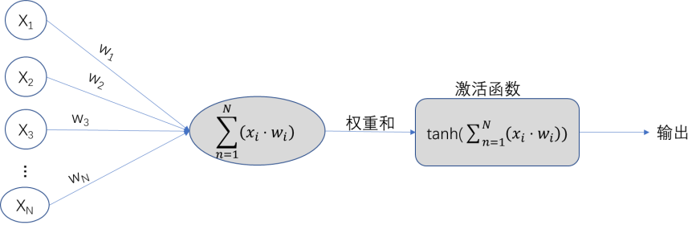

图2.1 人工神经元的结构

人工神经元接受一系列输入x1x2x3…xn，每个输入都有与之对应的权重wi相乘。带有权重信息的输入相加的和，传递给激活函数tanh。激活函数产生最后的输出。

2.1.2人工神经网络

人工神经网络（Artificial neural
network,ANN）是若由干神经元组合和堆叠形成的网状结构。最经典神经网络是全连接前馈神经网络，其结构如图2.2所示。

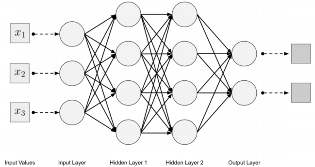

图2.2 全连接前馈神经网络的拓扑结构[10]

其中，第一层被称为输入层，最后一层被称为输出层，其余层被称为隐藏层。每一层都可以有不同的节点数量，每一层都和其相邻的下一层全连接，使得整个神经网络为非循环图。某一层所有神经元的输出都成为下一层每个神经元的输入。

2.1.3循环神经网络

循环神经网络(Recurrent Neural
Network,RNN)是一类具有短期记忆能力的神经网络。在循环神经网络中，神经元不但可以接受其他神经元的信息，也可以接受自身的信息，形成具有环路的网络结构，这主要通过将循环神经网络时间t时刻的输出作反馈给t+1时刻的循环神经网络作为输入。和前馈神经网络相比，循环神经网络更加符合生物神经网络的结构。循环神经网络已经被广泛应用在语音识别、语言模型以及自然语言生成等任务上。

循环神经网络的参数学习可以通过随时间反向传播算法来学习。随时间反向传播算法即按照时间的逆序将错误信息一步步往前传递。当输入序列比较长时，会存在梯度爆炸和消失问题。为了解决这个问题，人们对循环神经网络进行了很多的改进。

2.1.4门控循环单元

门控循环单元(Gated Recurrent
Unit,GRU)是标准循环神经网络的改进版，其内部结构如下所示：

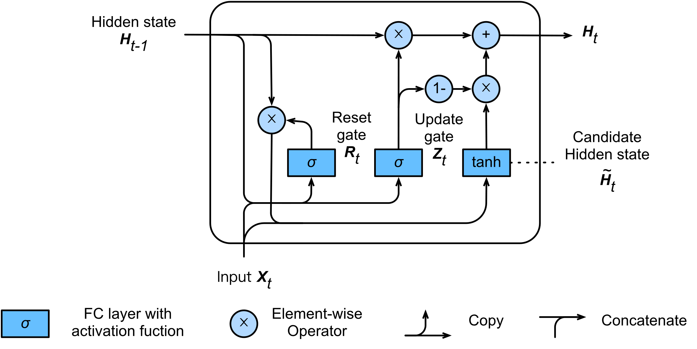

图2.3 全连接前馈神经网络的拓扑结构[10]

（图片来自网络<https://www.d2l.ai/_images/gru_3.svg>）

GRU引入了重置门(reset gate) 和更新门(update
gate),它们的输入都是当前时间的输入Xt和上一时间步的隐藏状态(Hidden state)
Ht-1，且都通过一个以sigmoid函数为激活函数的全连接层产生输出Rt和Zt。

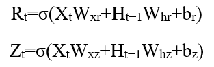

重置门产生的输出Rt和Ht-1通过矩阵点乘（图中用⊙表示）后的结果和Xt一起作为以tanh为激活函数的全连接层的输入，产生候选的隐藏状态。

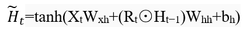

更新门产生的输出Zt作为一个分配系数，决定了新的隐藏状态Ht的组成来自旧隐藏状态Ht-1和候选隐藏状态的比例。

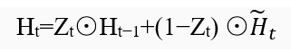

如果更新门的输出Zt为1，则新的隐藏状态就延续旧的隐藏状态，所以输入Xt被忽视。相反Zt无限接近0，则新的隐藏状态就接近通过计算得到的候选状态。

基于以上设计，GRU很好的解决了标准RNN存在的梯度消失问题，可以更好地捕捉时间序列中较大时间步之间的远程依赖信息。

2.1.5神经网络的训练方法

反向传播(BackPropagation,简称BP)算法是迄今为止最成功的神经网络学习算法，现实任务中大多数神经网络(包括循环神经网络)都使用BP算法进行训练[11]。BP
算法基于梯度下降(gradient
descent)策略，朝着使神经网络输出的均方误差（E）最小化的方向对权重参数进行调整：

其中Dt表示在第t个残基处，由真实二级结构产生的向量，是训练的目标输出；Zt表示在第t个残基处，神经网络从训练数据集产生的输出。神经网络学习的过程就是在每个训练过程中，根据神经网络输出的均方误差E的下降梯度，成比例地改变网络的权重参数W。

其中被称为学习率常数。

## 2.2实验方法

2.1.1氨基酸的表示方法——位置特异性矩阵

在利用神经网络预测蛋白质二级结构过程中，首先要将蛋白质序列信息数据化作为神经网络的输入。准确率的提高常来自于在蛋白质序列中引进了更好的特征信息。

最初的方法使用的是单个氨基酸残基的特征，对于待预测的蛋白质序列，每个不同的氨基酸用不同的字母表示。在将氨基酸序列传入神经网络时，可以简单的用正交编码表示，即每种氨基酸用一个20维的向量表示，该向量只有一维为1其余为0，且不同氨基酸的表示向量两两正交。某氨基酸序列的onehot编码如下图所示，

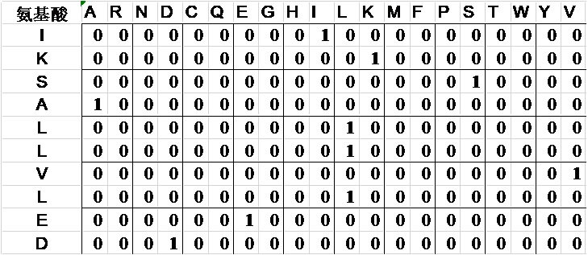

图2.4 onehot编码示意图

由于这种表示方法太过稀疏，且不能引入其他的信息，常常使得蛋白质二级结构的预测准确率较低。后来由引入了包含相邻残基信息的窗口作为模型的输入提高了一定的预测准确率。随后被包含进化信息的序列谱替代。序列谱通过多重序列比对获得，如由PSI-BLAST程序获得的PSSM谱，包含了同源序列之间的保守结构的信息。PSSM
表达式如下：

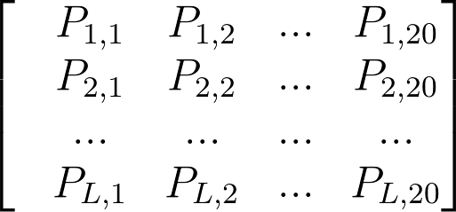

图2.5 PSSM的表达式

一个蛋白质序列可以生成一个PSSM
矩阵。蛋白质序列有L个氨基酸残基，PSSM矩阵就有L行。PSSM矩阵有20列，对应20种不同的氨基酸。第i行第j列元素Pi,j表示蛋白质的第i个氨基酸残基突变成第j种氨基酸的概率（以对数的形式表示）。某氨基酸序列的PSSM编码如下图所示：

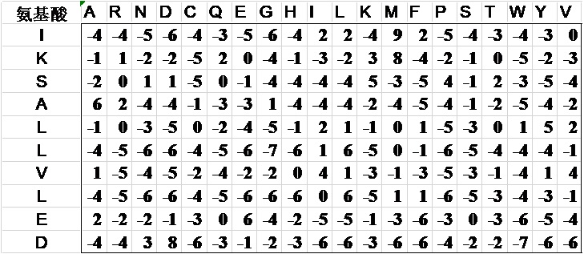

图2.6 onehot编码示意图

2.1.2蛋白质二级结构的表示方法

目前最常用的二级结构指定方法之一是 DSSP（define secondary structure of
protein），由Kabsch和Sander
在1983年提出。DSSP算法用于给蛋白质的氨基酸序列中的每一个氨基酸指定对应的二级结构。DSSP算法使用PDB格式的原子级分辨率的蛋白质三维结构坐标集数据，依靠以静电学定义进行的氢键识别，以及对主链和侧链二面角的计算，从而得到每个氨基酸残基的二级结构构象参数。DSSP算法将每个氨基酸残基的二级结构归纳为八类，分别是β桥（B）、β转角（T）、转角（S）、п
螺旋（H）、α螺旋（H）、310
螺旋（G）、β折叠（E）和其他所有状态（C）；在实际应用中常常简化为三类：α螺旋（H）、β折叠（E）和无规则卷曲（C）。为了方便神经网络对蛋白质二级结构分类的识别，我们将用字母表示的蛋白质二级结构类别，转换为用3个整数组成的数组表示，如下所示：E=[1,0,0]
H=[0,1,0] C=[0,0,1]

2.1.3预测评价指标

为了初步评价模型预测蛋白质二级结构的准确率，我们决定采用常用的容易实现的三态总体准确率Q3和Matthews
correlation coefficients（MCC）方法。

Q3准确率定义为：，其中N为所有用于预测二级结构的氨基酸序列的残基总数，Nr为正确预测其二级结构的氨基酸残基数。

2.3实验工具介绍

2.3.1 python简介

Python是由Guido van
Rossum于1991年设计的脚本语言，经过近30年的发展，已成为一门在互联网、科学计算等领域广泛使用的高级编程语言。与C、java语言使用大括号区分代码结构不同，Python严格使用缩进划分代码块，具有清晰的层次结构；在语法上追求简洁的设计哲学，为实现一个功能或方法，通常Python只需使用更少的代码。Python
解释器可以在几乎所有的操作系统中运行，因此Python程序通常具有良好的跨平台性和移植性。

Python语言可以说是现在最流行的机器学习语言。Python拥有大量的数据分析、统计和机器学习库，使其成为许多数据科学家的首选语言。

2.3.2 tensorflow简介

TensorFlow由谷歌开发，是现在最流行的机器学习库之一。TensorFlow
是一个基于数据流图（data flow
graphs）进行数值计算的开源软件库。数据流图中含有节点（Nodes）和线（edges），节点用来表示数学操作，线指的是一个称为张量（tensor）的多维数组，代表了相连两个节点间的关系。TensorFlow架构十分灵活，从大型服务器、高性能工作站到个人计算机甚至移动设备都可以开展计算，进行机器学习。

Keras是一个高层神经网络API，能够运行在Tensorflow,Theano和CNTK之上。Keras是Tensorflow核心的一部分，因此是Tensorflow推荐使用的高层API。Keras由纯python语言编写，具有统一而简洁的调用接口，简化了模型构建流程，省去了大量底层代码，因此很适合快速的验证性和初步开发。Keras支持在CPU或GPU上进行计算，也对卷积神经网络和循环神经网络都有支持。在本实验过程中，为了减少代码实现方面的复杂度，我们以tensorflow为后端，使用Keras高级API搭建实验所需的神经网络模型。

## 2.4实验过程

2.4.1实验环境的准备

实验设备仅为性能普通的个人电脑一台。在操作系统方面，最初使用了linux,且尝试了不同发行版如ubuntu、manjaro和国产的deepin都能正常搭建实验所需的软件环境。之后在window
10操作系统上也能搭建实验环境，并无需修改地运行写好的软件。在几乎所有主流的操作系统上都能进行实验，这得益于python语言良好的跨平台性。为了叙述方便，以下实验步骤都在基于Linux的ubuntu(18.04,64bit)上完成。

Python语言的安装。打开终端后输入sudo apt install python3 安装。

Tensoflow安装。先安装python3包管理器pip3，在终端运行sudo apt install
python3-pip。然后用pip3安装tensorflow,在终端运行sudo pip3 install tensorflow。

之后安装一些必要或有利于开发python库。在终端运行sudo pip3 install
numpy,keras,matplotlib。为了利用GPU加快机器学习的速度，可以安装tensorflow
GPU版，但由于安装过程繁琐，且对实验结果没影响，故这里不说明，可参考官方教程。

2.4.2数据集的获得和处理

本实验的数据可以从网站www.compbio.dundee.ac.uk/jpred/about_RETR_JNetv231_details.shtml下载得到。

该数据集是JPred4所使用的数据集，它的训练和测试数据是从SCOP(Structural
Classification of
Proteins)超家族水平上选取的具有代表性的数据。因为SCOP是一个基于结构的分类系统，所有减少了训练数据之间和训练测试数据之间存在无意义序列相似性的可能性。首先从SCOPe
v.2.04中的每个超家族选取了1987条具有代表性的单一序列。然后对这1987条序列进行以下过滤：

1、移除306条蛋白质结构分辨率大于2.5埃的序列；

2、移除序列长度小于30个残基的序列，因为长度过小不易形成球状的蛋白质结构域，由于历史原因，移去大于800个残基的序列，它们常导致PSI-BLAST花费过长的时间；

3、移去20个由多条链组成蛋白质的序列；

4、移除缺少超过9个连续残基DSSP信息的序列；

5、移去PDB、DSSP和ASTRAL文件之间存在差异的序列。通过过滤，得到1507条序列，通过多次迭代随机分配后，分为训练数据集1507条和测试数据集150条，其中测试集序列分配三种二级结构含量和训练集几乎相同(\<1%)。

6、最后通过排除了10条不能正常通过PSI-BLAST程序产生结果的序列。最终，训练集有1348条氨基酸，测试集含有149条氨基酸。

经过测试，在训练集和测试集中氨基酸最大长度为759。神经网络模型虽然能接受不同长度序列的输入数据，但一次只能处理一个序列，因此存在训练速度很慢的问题。为了解决这个问题，将原始数据集中的每个氨基酸序列长度都扩充为760，不足的部分用统一的数据填充。由于PSSM矩阵为20\*L，20种氨基酸用不同的20维的向量表示，没有考虑表示没有氨基酸的情况。最开始的想法是用20维向量全0或全1表示不存在氨基酸，但与后面的方法相比，会降低预测准确率。所以在训练时将PSSM矩阵扩充为21\*760，即在原来的20\*L基础上，前L行在第21列添加0；从L+1行到760行，除第21列为1，其列余为0，表示如下：

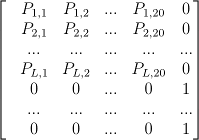

图2.7 改进的PSSM的表达式

2.4.3神经网络模型的构建

在利用keras搭建循环神经网络时，经过摸索，不断调整循环神经网络的构建和参数，最终获得了较为理想的模型。该模型的构建代码如下所示：
```python
model=Sequential()
model.add(Bidirectional (GRU(128,return_sequences=True,input_shape=(None,760)))
model.add(Dropout(0.5))
model.add(Bidirectional(GRU(128,return_sequences=True)))
model.add(TimeDistributed(Dence(4,activition=’softmax’))
opt=optimizers.Adam(lr=0.003)
model.compile(optimizer=opt,loss=’ categorical_crossentropy')
return model
```


模型示意图如下：

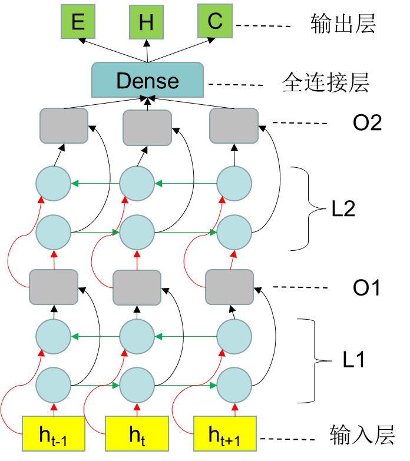

图2.8 模型示意图

从下往上，第一层为输入层，ht为第t时刻的输入，即某一序列中第t个氨基酸的PSSM编码。L1层为一个双向循环网络，其中每一个圆圈代表一个GRU单元，第一排圆圈表示前向循环神经网络，第二排圆圈表示反向循环神经网络，绿色箭头指示了GRU单元之间信息的传递方向，红色箭头为GRU单元的输入，GRU单元的输出用黑色箭头表示。由L1层产生的输出O1作为L2层的输入，L2层是一个和L1层一样的双向循环网络，其输出为O2。O2输入到一个基于时序的全连接层，最后给出输出。输出为第t个氨基酸对应二级结构分别为E、H、C的概率。

2.4.4神经网络模型的训练
```python
X_train=get_pssm('train.npy')
Y_train=get_dssp('train.npy')
model.fit(X_train, Y_train,batch_size=64,epochs=20,callbacks=[myHistory])
```

使用fit函数对模型进行训练，X_train，Y\_train为经过处理后的蛋白质序列谱数据和二级结构信息。batch_size指定了每批训练处理多少条序列，batch_size设为合适的大小，既能较快地进行训练，又不会因为内存溢出而中断训练。Epochs为一共训练的代数，经过一代训练，训练集的所有数据都将被神经网络学习一遍，通常需要经过多代训练，神经网络才能对训练数据进行足够的拟合。Callbacks,为响应函数，通过传入响应函数，可以在每代训练后，让模型在测试集上进行测试，以获得实时的预测准确率变化。

2.5实验结果

2.5.1 循环神经网络双向与单向的比较

双向循环神经网络（BRNN）的基本思想是对每个训练的序列有两个循神经网络，一个向前，一个向后，这两个循环神经网络都连接着同一个输出层这种结构的特点是每个输出层的节点都可以充分的利用完整的历史和未来的上下文信息。

实验首先对双向循环网络和单向循环神经网络进行比较，因为代码实现差异极小，从单向循环神经网络转为双向循环网络，在keras中，只需在外包装一个Bidirectional函数。在对比实验中，其他参数，如学习率（0.005）、迭代次数（20）、GRU单元数（128）等完全相同。实验结果如下，在20个迭代次数内，其中单向神经网络Q3准确率最高为73.2%，双向神经网络的Q3准确率最高为81.8%。

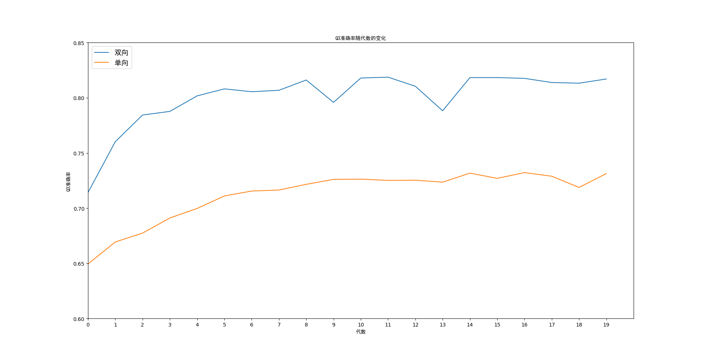图2.9
单层双向循环和单向循环网络预测准确率对比

2.5.2 循环神经网络双层和单层的比较

在单层循环神经网络基础上，再叠加一层GRU单元就可以形成双层的循环神经网络。双层循环神经网络被认为能比单层循环神经网络学到更深层的东西。虽然单层双向循环神经网络已能获得较高的预测准确率，但为了充分探索循环神经网络的潜能，我们引入双层双向循环网络进行对比，其他参数，如学习率（0.005）、迭代次数（20）、GRU单元数（128）等完全相同。实验结果如下：

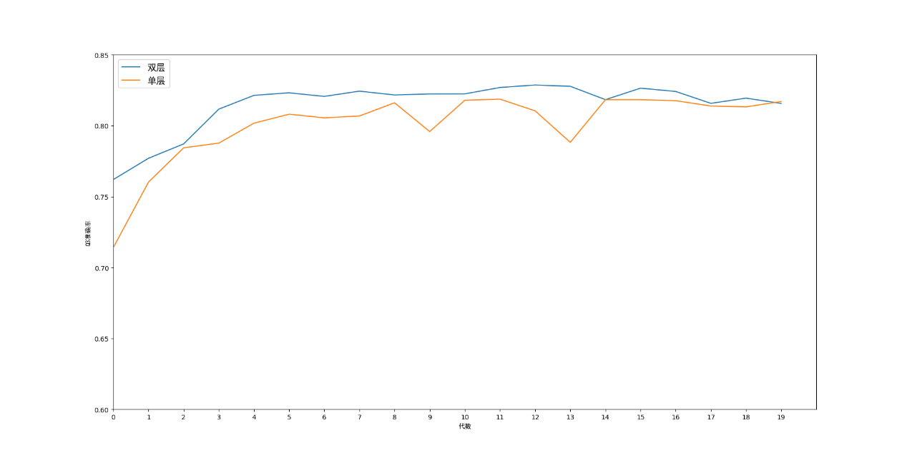

图2.10 单层和双层循环神经网络预测准确率对比

在20次迭代训练中，单层网络预测的准确率最高为81.8%，双层的为82.8%。

2.5.3 训练学习率的优化

在选定的双向双层循环神经网络上，我们对学习率这个参数进行优化。通过对模型进行初步调试后，得知学习率在0.001-0.005内常取得较高的预测准确率。以下实验，将学习率分别设为为0.001、0.002、0.003、0.004、0.005，然后让模型进行训练，分别计算每代训练后的预测准确率，其结果如下所示：

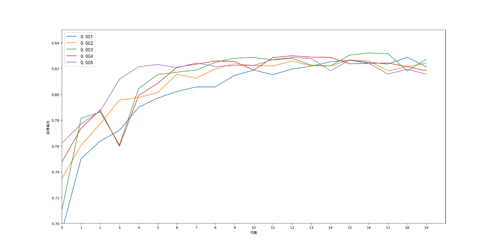

图2.11 五种不同学习率预测准确率随训练代数变化

| 学习率 | 最高预测准确率 |
|--------|----------------|
| 0.001  | 0.828          |
| 0.002  | 0.826          |
| 0.003  | 0.832          |
| 0.004  | 0.829          |
| 0.005  | 0.828          |

表2.1 五种不同学习率的最高预测准确率

2.5.4循环神经网络与卷积神经网络的比较

本实验还设计并优化了一种卷积神经网络（CNN）模型，将其和循环神经网络（RNN）进行比较，其结果为，RNN模型在学习率0.003下经过17个训练代数达到最高的83.2%，CNN模型在学习率0.0005下经过53个训练代数后达到82.7%。但在训练过程中发现CNN模型在GPU进行运算下，速度非常快，每个训练代数只需2s，而RNN需要130多秒。

# 讨论

3.1双向循环神经网络优于单向

从循环神经网络双向与单向的比较实验可以看出，双向循环神经网络在预测准确率无论在训练的第几个世代都优于单向循环神经网络10%左右，且最高准确率相差8.6%。因此在构建循环神经网络时，优先使用双向循环神经网络，这将有助于预测准确率的提高。

单向循环神经网络只保留了过去的信息，因此只能预测到蛋白质序列中前面的氨基酸残基对后面氨基酸残基的影响。而双向循环神经网络以两种方式处理输入，从过去到未来和从未来到过去。对应蛋白质序列而言，即从前后两个方向进行，既能获得前面的氨基酸残基对后面的影响，又能获得后面的氨基酸残基对前面的影响，很好地表现了蛋白质折叠过程前后残基的相互作用。因此双向循环网络在蛋白质二级结构预测方面比单向循环神经网络有绝对优势。

3.2双层循环网络与单层不相上下

从循环神经网络双层与单层的比较实验可以看出，双层循环神经网络在预测准确率上与单层循环神经网络只存在较小的优势，而且随着训练迭代次数的增加，它们之间的差距越来越小，但它们都存在过拟合导致预测准确率下降的问题。从20个世代内最高预测准确率来看，双层在第13代达到82.8%，单层在第12代达到81.8%，仅相差1%。而且在训练过程中我们注意到，在使用GPU进行神经网络训练时双层循环网络每代训练评价花费时间135秒，而单层只需49秒。因此单层循环神经网络比双层循环神经网络训练时间快接近两倍，准确率只是低1%。但为了探究循环神经网络预测准确率的极限，我们不惜使用更耗时的双层循环神经网络进行后面实验。

3.3学习率对预测准确率的影响

学习率作为模型的一个超参数，控制着基于损失梯度调整神经网络权值的速度。学习率的大小直接影响了预测准确率的变化过程，适当的学习率，使得模型可以快速地收敛，且能较好地拟合训练数据。通过学习率优化实验的结果可以看出，较大的学习率如0.005，使得模型能较早地（第6代）达到较高的预测准确率（82.3%），但不利于对训练数据的完美拟合，使得最高预测准确率为82.8%。较低的学习率如0.001，使得模型的预测准确率随预测代数提升得过慢，在第19代才逐渐达到82.8%，且之后由于过拟合效应，又有下降的趋势。有实验结果可知当学习率为0.003时，能较早的达到较高的预测准确率，且能在过拟合之前获得最高83.2%的预测准确率。

3.4循环神经网络与卷积神经网络的优劣

通过分析循环神经网络与卷积神经网络对比实验的结果，我们发现，循环神经网络有收敛速度快，预测准确率高的特点，但有训练耗时长的缺点；而卷积神经网络具有训练速度快，训练总耗时少，但在准确率上比循环神经网络稍低。可能是由于卷积神经网络的窗口大小只有17个氨基酸残基，无法捕捉到更远距离残基的信息，且单纯提高窗口大小并不能提高预测准确率；与此同时，循环神经网络，每层被设计为128个GRU单元，因此理论上，能捕捉到128个相邻氨基酸的残基信息用于二级结构的预测。长距离的残基依赖关系包含着重要的蛋白质二级结构分类信息，如两个β折叠之间可以通过在序列上相距很远的氨基酸残基形成的氢键维持[12]。例如第4个和第60个氨基酸残基之间可以通过二硫键连接起来，参与形成同一种二级结构[13]。而循环神经网络被设计为可以捕获远距离依赖关系，因此预测准确率上限高于卷积神经网络。

# 总结与展望

## 4.1 论文所做工作与讨论

本课题主要研究根据蛋白质一级序列预测对应的蛋白质三种二级结构，选用的方法为循环神经网络。在确定使用方法后，首先对机器学习进行了初步学习，后对循环神经网络进行的重点学习，在学习过程中，通过实践，掌握了tensorflow框架的用法。有了以上基础后，开始进行课题的研究。首先在学长的指导下获得了实验所需要的数据集，并对该数据集进行了处理，以使得可以方便地作为神经网络的训练和测试数据。在探索循环神经网络模型的构架过程中，通过不断的查阅资料和实验摸索，掌握了双向循环神经网络、多层循环神经网络的搭建，对网络模型中的一些参数，如单元个数、训练代数、批处理个数、学习率等，有了理性的认识，并会通过调整这些参数，提高模型的预测能力。最后对另一种神经网络——卷积神经网络进行了一些探索，将其和循环神经网络模型进行了对比实验。

我们最终采用的模型为双层双向循环神经网络，使用富含生物进化信息的PSSM矩阵表示氨基酸，用DSSP指定蛋白质的二级结构，使用与JPred4相同的训练集和测试集。进行多次实验，不断优化实验参数，以获得更好的实验结果。最终超过了JPred4的82.0%，最高能达到83.2%的预测准确率。达到了课题对预测准确率的要求。

## 4.2 论文不足与研究方向

论文由于完成的时间和本人能力的限制，在该题目实验研究的广度和深度还不够。论文存在的不足和与之对应的研究方向主要集中在以下几个方面：

4.2.1数据集单一

在实验过程中，由于时间限制，只用到了有JPred4作者分享的数据集，虽然该数据集很具有代表性和实用性，但未能在其他数据集上和其他主流方法进行对比，我觉得还是不尽人意。后续的研究将在更多的数据集上验证本模型的性能。

4.2.2神经网络模型结构选择

本实验在构建神经网络模型时，只是简单地堆叠了两个相同的双向循环神经网络层，未能探索更加复杂的神经网络构建，例如，采用不同的神经网络如卷积神经网络层进行堆叠，或堆叠更多的网络层组成深度网络。后续研究将对更多的神经网络架构进行研究。

4.3.3 神经网络训练过程

在神经网络训练过程中，也存在一些不足之处。如学习率，最新的方法是使用变化的学习率，即在前期采用较大的学习率以提高拟合速度，在训练后期采用较小学习率以提高拟合精度，前后学习率的差距可达100倍。在训练过程中也没有使用早停（early
stop）技术，可以在过拟合影响预测准确率时，提前退出训练过程。本人在实验过程中由于时间和能力的限制，未能成功将这些有用的技术应用到模型中，但在后续的研究中，将努力实现这些功能，以使模型具有更强的实用性。

# 参考文献

[1] Noble M E, Endicott J A, Johnson L N. Protein kinase inhibitors: insights
into drug design from structure[J]. Science, 2004, 303(5665): 1800-5.

[2] Clark K, Karsch-Mizrachi I, Lipman D J, et al. GenBank[J]. Nucleic Acids
Research, 2015, 44(D1): D67-D72.

[3] Heffernan R, Paliwal K, Lyons J, et al. Improving prediction of secondary
structure, local backbone angles, and solvent accessible surface area of
proteins by iterative deep learning[J]. Sci Rep, 2015, 5: 11476.

[4] Zhou Y, Duan Y, Yang Y, et al. Trends in template/fragment-free protein
structure prediction[J]. Theor Chem Acc, 2011, 128(1): 3-16.

[5] 王菲露, 计算机仿真 宋 J. 基于广义回归神经网络的蛋白质二级结构预测[J], 2012,
29(2): 184-187.

[6] Plaxco K W, Simons K T, Baker D. Contact order, transition state placement
and the refolding rates of single domain proteins[J]. J Mol Biol, 1998, 277(4):
985-94.

[7] 张海霞, 唐焕文, 张立震, et al. 蛋白质二级结构预测方法的评价[J], 2003, 20(6):
000735-740.

[8] Chou P Y, Fasman G D. Prediction of protein conformation[J]. Biochemistry,
1974, 13(2): 222-45.

[9] Garnier J, Osguthorpe D J, Robson B. Analysis of the accuracy and
implications of simple methods for predicting the secondary structure of
globular proteins[J]. J Mol Biol, 1978, 120(1): 97-120.

[10] Patterson J, Gibson A. Deep learning: A practitioner's approach[M]. "
O'Reilly Media, Inc.", 2017.

[11] 周志华. 机器学习[M]. Qing hua da xue chu ban she, 2016.

[12] Zhou J, Troyanskaya O G J a P A. Deep supervised and convolutional
generative stochastic network for protein secondary structure prediction[J],
2014.

[13] Li Z, Yu Y J a P A. Protein secondary structure prediction using cascaded
convolutional and recurrent neural networks[J], 2016.
